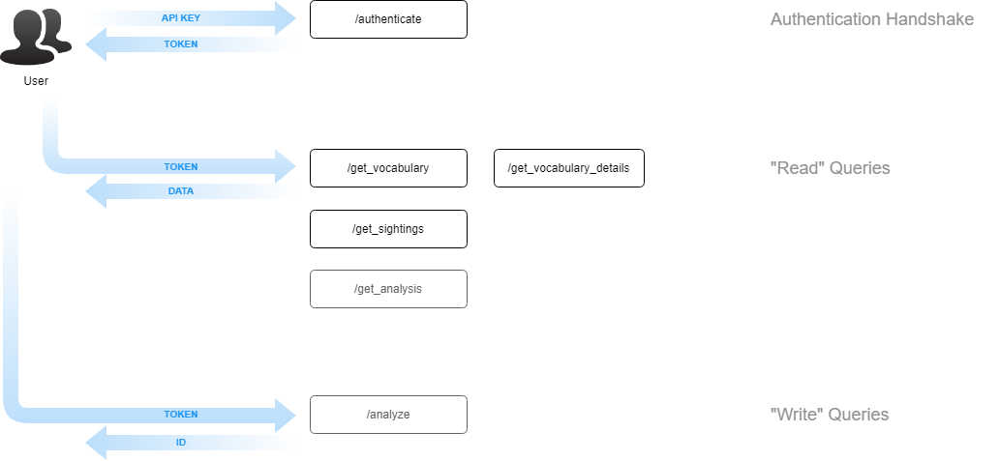

# API v4.4

## Overview

## Changelog

This is a backwards-compatible release of the Hatebase API. Notable enhancements include:

- Search sightings by city or community. Hatebase tracks data across 13,000+ individual communities.
- Search sightings by radial distance from latitude /longitude, which is helpful if you're searching somewhere other than one of our 13,000+ communities.
- "Type" attribute returned with sightings: this will always be "recipient", "overhead" or "used"
- "Source" attribute returned with sightings, indicating where the sighting originated
- New [API error code](https://hatebase.org/api_error_codes) specifically for invalid locations

## Endpoints

### Authentication

- [authenticate](authenticate.md)

### Read Queries

- [/get_vocabulary](get_vocabulary.md)
- [/get_vocabulary_details](get_vocabulary_details.md)
- [/get_sightings](get_sightings.md)
- [/get_analysis](get_analysis.md)

### Write Queries

- [/analyze](analyze.md)
